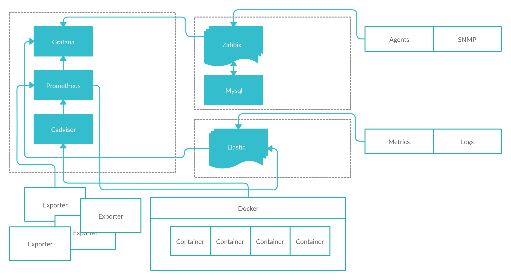
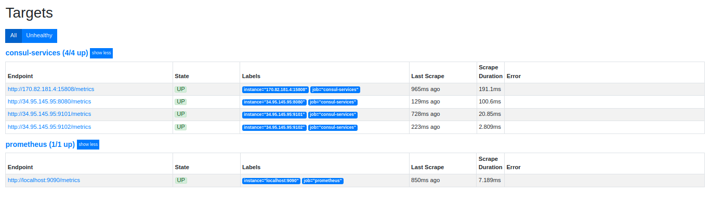
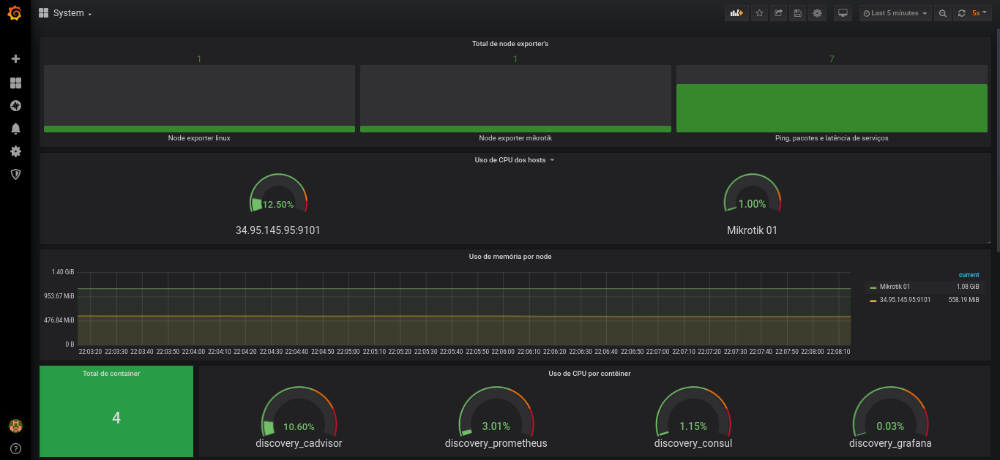
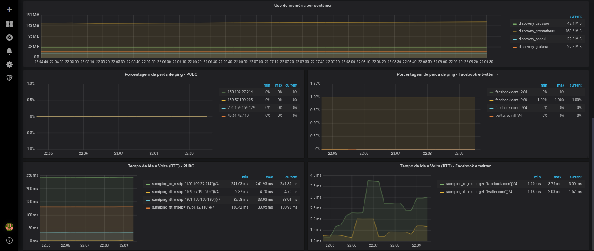

# monitoring2
 

 
Ferramentas de monitoramento de hosts, containers e serviços
 
- Node Exporter's
- Docker
- Cadvisor
- Prometheus
- Grafana
 
Infraestrutura
 
- Mikrotik
- Server Linux
 
Instalação do Docker e iniciando o cluster Swarm
```
# curl -fsSL https://get.docker.com | sh
# docker swarm init
```
 
Clonado o repositório monitoring2
```
# git clone https://github.com/madson7/monitoring2.git
 
# cd monitoring2
```
 
Build da imagem do Promotheus
```
# docker build -t madson7/prometheus_alpine ./dockerfiles/prometheus
```
 
Deploy Stack com Docker Swarm
```
# docker stack deploy -c docker-compose.yml monitoring2
```
 
Status dos serviços
```
# docker service ls
```
 
Iniciar o Node do Mikrotik
```
# ./conf/node-exporter/mikrotik_exporter -address 192.168.0.10 -device "Mikrotik 01" -password 12345678 -user prometheus
```
Onde -address é o endereço do seu mikrotik. -device é o nome do rótulo do dispositivo na saída de métricas para o prometheus. O usuário e senha deve ser criadas no seu mikrotik
 
Iniciar o Node do Linux
```
# ./conf/node-exporter/linux_exporter --web.listen-address=":9111"
```
Onde --web.listen-address=":9111" é a porta do seu servidor Linux local.
 
Iniciar o Ping Exporter
```
# ./conf/node-exporter/ping/ping_exporter --config.path conf/node-exporter/ping/ping.yml --web.listen-address=":9121"
```
Onde --web.listen-address=":9121" é a porta do seu servidor Linux local e --config.path são os IP's e sites.
 
Acessando o Prometheus
http://localhost:9090/targets

 
Acesse o Grafana http://localhost:3000, adicione fonte de dados do Prometheus e importe a dashboard conf/grafana/dashboard/*.json

